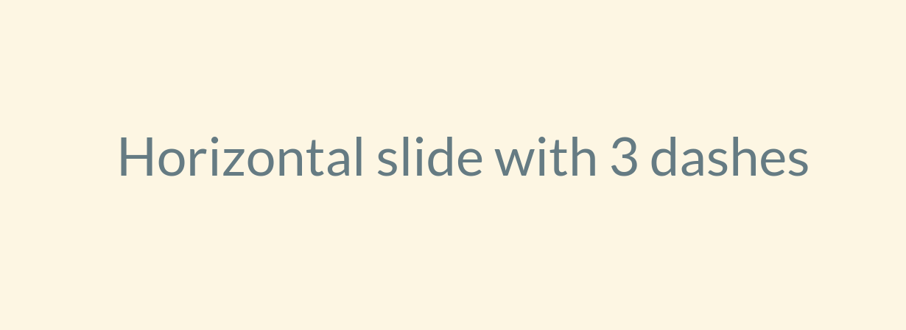

## Example presentation

help us

----

Vertical slide with 4 dashes

Higligh code inside `[]` blocks with `|` as separator


```python[4-5|1|2]
def main():
    run_something()

if __name__ == '__main__':
    main()
```
<p class="fragment">Fade in</p>
<p class="fragment highlight-red">Highlight red</p>

---

Horizontal slide with 3 dashes

---

Slide with image:



----

Autoplay video:

<video data-autoplay src="http://clips.vorwaerts-gmbh.de/big_buck_bunny.mp4"></video>


---

Stacked images:

<div class="v-stack">
  
  
  
</div>

---

Last Slide
